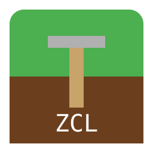

# ZayCraft Legends



**A 2D top-down survival/RPG sandbox game inspired by Minecraft.**  
Built with [LÖVE2D](https://love2d.org) (11.4+).

Created by **Zayfire Studios** — Sheldi & Zaiden.

---

## 🎮 Features

- **Infinite Procedural World** – Explore vast landscapes with multiple biomes (grasslands, forests, deserts, mountains, water).
- **Survival & Creative Modes** – Choose your playstyle when creating a world.
- **Mobs & Combat** – Face zombies, skeletons, spiders, and creepers that spawn at night.
- **Day/Night Cycle** – 20-minute real-time days with dynamic lighting.
- **Inventory System** – Collect resources and manage your items (27 slots).
- **Custom UI Engine** – A clean, responsive interface built from scratch.
- **Global Custom Cursor** – A stylized sword cursor that appears everywhere.
- **Mobile Support** – Basic touch controls (tap = left click).
- **Persistent Settings** – Save your preferences (volume, render distance, vsync, fullscreen).
- **World Management** – Create, select, and delete worlds.
- **Save/Load System** – Your progress is saved automatically.
- **Debug Mode** – Press F3 to see chunk borders.
- **Credits Screen** – A scrolling tribute to the developers.

---

## 📸 Screenshots

_(Add screenshots here)_

---

## 🚀 How to Play

### Controls

| Key                           | Action                                 |
| ----------------------------- | -------------------------------------- |
| **W/A/S/D** or **Arrow Keys** | Move player                            |
| **E**                         | Open inventory                         |
| **F3**                        | Toggle debug mode (show chunk borders) |
| **F5**                        | Save world manually                    |
| **ESC**                       | Return to previous menu / Quit         |

### Game Modes

- **Survival** – Mobs spawn at night, you take damage.
- **Creative** – Peaceful mode (no mobs).

### Getting Started

1. Launch the game.
2. Click **Play** to go to the world select screen.
3. Click **Create New** to make a world.
4. Enter a name and choose **Survival** or **Creative**.
5. Click **Create**, then select your world and hit **Play**.
6. Explore, gather resources, and survive!

---

## 🛠️ Installation

### From Source (for developers)

```bash
# Clone the repository
git clone https://github.com/MrJeff1/ZayCraft.git
cd ZayCraft

# Install Love2D (if not already installed)
# Ubuntu/Debian:
sudo apt install love

# Arch:
sudo pacman -S love

# macOS:
brew install love

# Windows: Download from https://love2d.org

# Run the game
love .
```

### From Pre-built Packages

Download the latest release for your platform from the [Releases](https://github.com/MrJeff1/ZayCraft/releases) page.

- **Windows**: `ZayCraftLegends-win32.zip`/`ZayCraftLegends-win64.zip`
- **macOS**: `ZayCraftLegends-macos.zip`
- **Linux**: `ZayCraftLegends.AppImage`
- **Web**: `ZayCraftLegends-lovejs.zip`
- **All**: `ZayCraftLegends.love`
  > NOTE: Love2D is required on your system to run `ZayCraftLegends.love`

---

## 🧰 Development

### Project Structure

```
ZayCraftLegends/
├── main.lua              # Entry point
├── conf.lua              # Love2D config
├── core/                  # Core engine modules
├── entities/              # Player, mobs, base entity
├── inventory/             # Inventory system
├── lib/                   # External libraries (serpent, UI)
├── renderer/              # Camera, tile rendering
├── states/                # Game states (menu, world select, game, settings, credits)
├── systems/               # Physics, mob spawning
├── ui/                    # Inventory screen
├── world/                 # World generation, chunks, tiles
├── assets/                # Textures, icons, cursor
├── tools/                 # Texture generation script
└── worlds/                # Saved worlds
```

### Requirements

- LÖVE2D 11.4 or higher
- Python 3 (for texture generation, optional)

### Building from Source

1. Make your changes.
2. Test with `love .`
3. Package using [makelove](https://github.com/pfirsich/makelove) (config provided in `makelove.toml`).

### Generating Textures

```bash
python3 tools/generate_textures.py
```

---

## 📜 License

Copyright © 2026 Zayfire Studios

This project is licensed under the MIT License. See the [LICENSE.md](LICENSE.md) file for details.

---

## 🙏 Acknowledgements

- The [LÖVE2D community](https://love2d.org) for the amazing framework.
- [Serpent](https://github.com/pkulchenko/serpent) for Lua serialization.
- All our playtesters and contributors.

---

## 📞 Contact

- **Zayfire Studios** – [website](http://zayfirestudios.com)
- **Sheldi** – [psheldig@gmail.com](mailto:psheldig@gmail.com)
- **Zaiden**

---

_Made with 💚 in Lua_
